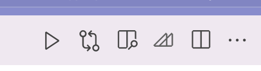

## 岩井研 Marp テンプレートリポジトリ

### 基本的に push 禁止です！ みんなに影響が及んじゃうので。

### 使い方

1. VSCode に Marp 拡張を導入
2. このリポジトリをクローンする。または、settings.json のみコピーする。
3. template.md を参考に、`marp: true` と `theme: cpslab` と書くと、スタイルが適用される。

### 出力

PowerPoint, HTML, PDF などから選べる。
VSCode 上の M のようなマークを押して出力

PowerPoint がおすすめ！！

### 画像を貼りたい時

`` と書くと、画像が貼れる。

スライドを PowerPoint や PDF で出力する場合、画像は埋め込まれる。ローカルの画像で問題ない。

スライドを HTML で出力する場合、インターネット上にある画像しか表示できない。以下の方法がある

- 論文がインターネット上で公開されている場合、画像のリンクを取得する
- image ディレクトリに画像を入れ、自分の GitHub アカウントにリポジトリを作成して push -> 画像のリンクを取得する
- クラウドストレージに画像をあげ、その共有リンクを取得する
