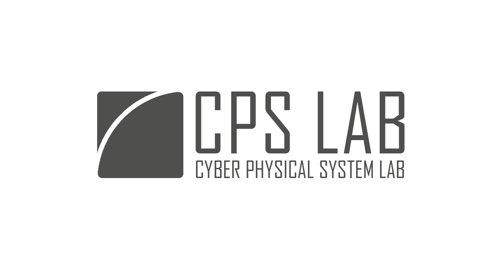

<!-- _paginate: false -->

# テンプレートの使い方

#### B4 20XX000

#### 岩井将行 🦭

---

<!-- _paginate: false -->

<!-- _paginate:false と書くことで、ページ番号を無くせます -->

画像はこうやって貼ります

---

<!-- _header: 'ここにヘッダーが書けます' -->

# 記法は基本的に

## Markdown 記法が

### 使えます

**詳しくは調べてみてね ⭐️**

---

- 箇条書きは
- 短いと
- 中央揃えになる

---

- こーーーーーーーーーーーーーーーーーーーーーーーーーーーーーんなふうに
- 長いと左揃えになります
- 1 行でも長ければ OK
- この仕様が嫌だったら CSS を書き換えてもいい

---
